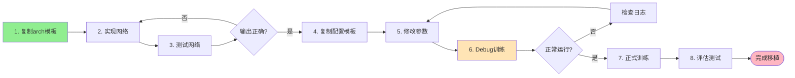

# BasicSR 网络移植开发模板

完整的深度学习网络移植到 BasicSR 框架的开发模板集合

---

## 📦 模板文件清单

| 文件名 | 说明 | 行数 | 优先级 |
|--------|------|------|--------|
| `network_migration_guide.md` | 📖 完整移植指南 | 500+ | ⭐⭐⭐⭐⭐ |
| `QUICK_REFERENCE.md` | 📝 快速参考（一页纸） | 150+ | ⭐⭐⭐⭐⭐ |
| `arch_template.py` | 🏗️ 网络架构模板（4个示例） | 350+ | ⭐⭐⭐⭐⭐ |
| `data_template.py` | 📊 数据集模板（4个示例） | 400+ | ⭐⭐⭐⭐ |
| `model_template.py` | 🎯 模型模板（2个示例） | 450+ | ⭐⭐⭐⭐ |
| `loss_template.py` | 📐 损失函数模板（6个示例） | 300+ | ⭐⭐⭐ |
| `train_config_template.yml` | ⚙️ 训练配置模板 | 200+ | ⭐⭐⭐⭐⭐ |
| `test_config_template.yml` | 🧪 测试配置模板 | 150+ | ⭐⭐⭐⭐ |
| `complete_example/` | 📂 完整示例项目 | - | ⭐⭐⭐⭐⭐ |

---

## 🚀 快速开始

### 30 分钟完成网络移植

#### 步骤 1: 复制模板 (5 分钟)

```bash
# 复制网络架构模板
cp templates/arch_template.py basicsr/archs/mynet_arch.py

# 复制训练配置模板
cp templates/train_config_template.yml options/train/MyNet/train_MyNet_x4.yml
```

#### 步骤 2: 修改网络 (10 分钟)

编辑 `basicsr/archs/mynet_arch.py`:

```python
@ARCH_REGISTRY.register()
class MyNet(nn.Module):
    def __init__(self, num_in_ch=3, num_out_ch=3, ...):
        # 实现你的网络结构
        pass

    def forward(self, x):
        # 实现前向传播
        return output
```

#### 步骤 3: 修改配置 (10 分钟)

编辑 `options/train/MyNet/train_MyNet_x4.yml`:

```yaml
network_g:
  type: MyNet
  # 添加你的网络参数
```

#### 步骤 4: 测试运行 (5 分钟)

```bash
# Debug 模式测试
python basicsr/train.py -opt options/train/MyNet/train_MyNet_x4.yml --debug
```

---

## 📚 模板使用指南

### 1. 网络架构模板 (`arch_template.py`)

**包含 4 个示例**:
- ✅ **SimpleNet**: 基础网络结构
- ✅ **ResidualNet**: 带残差连接的网络
- ✅ **MultiScaleNet**: 多尺度特征提取
- ✅ **AttentionNet**: 带注意力机制的网络

**使用方法**:
```python
# 1. 复制到 basicsr/archs/
# 2. 选择一个示例作为起点
# 3. 修改类名和结构
# 4. 实现 __init__ 和 forward
```

---

### 2. 数据集模板 (`data_template.py`)

**包含 4 个示例**:
- ✅ **PairedDatasetTemplate**: 配对图像（LQ-GT）
- ✅ **SingleDatasetTemplate**: 单图像（仅GT）
- ✅ **DegradationDatasetTemplate**: 在线退化生成
- ✅ **VideoDatasetTemplate**: 视频数据

**关键方法**:
```python
def __init__(self, opt):
    # 读取配置，初始化路径
    pass

def __getitem__(self, index):
    # 返回字典: {'lq': ..., 'gt': ..., 'lq_path': ...}
    return data_dict

def __len__(self):
    return len(self.paths)
```

---

### 3. 模型模板 (`model_template.py`)

**包含 2 个示例**:
- ✅ **SimpleModelTemplate**: 单网络训练
- ✅ **GANModelTemplate**: 双网络 GAN 训练

**关键方法**:
```python
def feed_data(self, data):
    # 将数据送入 GPU

def optimize_parameters(self, current_iter):
    # 一个训练步骤

def test(self):
    # 测试/推理

def save(self, epoch, current_iter):
    # 保存模型
```

**使用建议**: 大多数情况下直接用 `SRModel`，不需要创建新模型。

---

### 4. 损失函数模板 (`loss_template.py`)

**包含 6 个示例**:
- ✅ **SimpleLossTemplate**: 基础像素损失
- ✅ **CharbonnierLossTemplate**: 鲁棒 L1 损失
- ✅ **PerceptualLossTemplate**: VGG 感知损失
- ✅ **FrequencyLossTemplate**: 频域损失
- ✅ **MultiScaleLossTemplate**: 多尺度损失
- ✅ **CombinedLossTemplate**: 组合损失

**关键方法**:
```python
def forward(self, pred, target, weight=None):
    # 计算损失
    return loss * self.loss_weight
```

---

### 5. 配置文件模板

#### 训练配置 (`train_config_template.yml`)

**核心部分**:
```yaml
# 1. 网络配置
network_g:
  type: MyNet
  param1: value1

# 2. 数据集配置
datasets:
  train: {...}
  val: {...}

# 3. 训练策略
train:
  optim_g: {...}
  scheduler: {...}
  pixel_opt: {...}

# 4. 日志配置
logger:
  use_tb_logger: true
```

#### 测试配置 (`test_config_template.yml`)

**核心部分**:
```yaml
# 1. 网络配置（必须与训练时一致）
network_g: {...}

# 2. 测试数据集
datasets:
  test_1: {...}

# 3. 模型路径
path:
  pretrain_network_g: experiments/.../models/net_g_latest.pth

# 4. 评估指标
val:
  metrics:
    psnr: {...}
```

---

## 🎯 典型工作流



---

## 📖 详细文档说明

### 1. `network_migration_guide.md`（必读）

**内容**:
- ✅ BasicSR 架构详解
- ✅ Registry 机制原理
- ✅ 完整移植流程图
- ✅ 每个模块的详细说明
- ✅ 调试技巧和常见问题
- ✅ 进阶扩展方法

**适用**: 第一次移植网络、深入理解框架

---

### 2. `QUICK_REFERENCE.md`（常用）

**内容**:
- ✅ 5 步移植流程
- ✅ 最小化示例代码
- ✅ 常见场景对应关系
- ✅ 调试检查清单
- ✅ 参数速查表
- ✅ 常见错误解决

**适用**: 日常移植、快速查询

---

## 💡 最佳实践

### 实践 1: 渐进式开发

```
第1天: 实现网络架构，测试前向传播
第2天: 配置训练参数，Debug模式测试
第3天: 小数据集训练，验证收敛
第4天: 完整数据集训练
第5天: 评估测试，调优参数
```

### 实践 2: 模块复用

```
优先复用现有模块:
  1. 数据集 → 用 PairedImageDataset（80%情况适用）
  2. 损失函数 → 用 L1Loss/CharbonnierLoss（90%情况适用）
  3. 模型 → 用 SRModel（70%情况适用）

只在必要时创建新模块！
```

### 实践 3: 配置管理

```
建立配置文件命名规范:
  train_{NetworkName}_{Scale}_{Dataset}.yml

示例:
  train_RCAN_x4_DIV2K.yml
  train_EDSR_x2_Flickr2K.yml
  train_MyNet_x4_Custom.yml
```

---

## 🔗 相关资源

- **BasicSR GitHub**: https://github.com/XPixelGroup/BasicSR
- **官方文档**: https://basicsr.readthedocs.io/
- **论文列表**: BasicSR 支持的所有网络论文

---

## 📞 获取帮助

遇到问题时的检查顺序:

1. ✅ 查看 `QUICK_REFERENCE.md` 的常见错误
2. ✅ 查看 `network_migration_guide.md` 的详细说明
3. ✅ 查看 BasicSR 官方文档
4. ✅ 查看现有网络的实现（如 `rrdbnet_arch.py`）
5. ✅ 在 BasicSR GitHub Issues 搜索

---

## 🎉 成功案例

使用这套模板移植的网络示例:

- ✅ RCAN (Residual Channel Attention Network)
- ✅ EDSR (Enhanced Deep SR)
- ✅ SwinIR (Swin Transformer for Image Restoration)
- ✅ RealESRGAN (Real-World SR)
- ✅ ... 可以移植任何图像处理网络！

---

**模板版本**: v1.0
**作者**: AI 多媒体开发团队
**适用于**: BasicSR 2.x+
**最后更新**: 2025-01-XX

