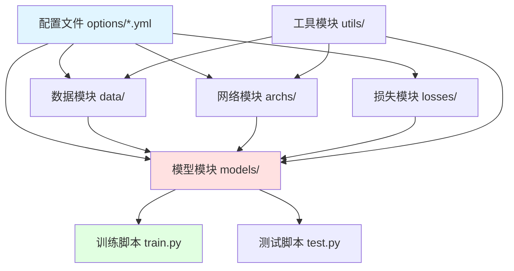
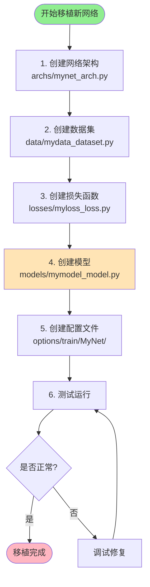

# BasicSR 网络移植开发指南

完整的深度学习网络移植到 BasicSR 框架的开发模板

---

## 📋 目录

- [1. 概述](#1-概述)
- [2. 移植流程](#2-移植流程)
- [3. 文件结构](#3-文件结构)
- [4. 模板文件详解](#4-模板文件详解)
- [5. 完整示例](#5-完整示例)
- [6. 常见问题](#6-常见问题)

---

## 1. 概述

### 1.1 BasicSR 框架架构



### 1.2 Registry 机制

BasicSR 使用 Registry 模式实现模块化：

```python
# 所有模块通过装饰器注册
@ARCH_REGISTRY.register()
class MyNetwork(nn.Module):
    pass

# 配置文件中通过 type 字段调用
network_g:
  type: MyNetwork
  param1: value1
```

---

## 2. 移植流程

### 标准移植步骤



### 推荐顺序

1. ✅ **网络架构** (`archs/`) - 核心模块
2. ✅ **数据集** (`data/`) - 数据加载
3. ✅ **损失函数** (`losses/`) - 训练目标
4. ✅ **模型** (`models/`) - 训练逻辑
5. ✅ **配置文件** (`options/`) - 超参数配置
6. ✅ **工具函数** (`utils/`) - 可选，特殊需求

---

## 3. 文件结构

### 3.1 需要创建的文件

```
BasicSR/
├── basicsr/
│   ├── archs/
│   │   └── mynet_arch.py              ⭐ 必需：网络架构
│   ├── data/
│   │   └── mydata_dataset.py          ⭐ 必需：数据集
│   ├── losses/
│   │   └── myloss_loss.py             ⭐ 可选：自定义损失
│   ├── models/
│   │   └── mymodel_model.py           ⭐ 必需：训练模型
│   └── utils/
│       └── myutil.py                  ⭐ 可选：工具函数
├── options/
│   ├── train/
│   │   └── MyNet/
│   │       └── train_MyNet_x4.yml     ⭐ 必需：训练配置
│   └── test/
│       └── MyNet/
│           └── test_MyNet.yml         ⭐ 必需：测试配置
└── scripts/
    └── data_preparation/
        └── prepare_mydata.py          ⭐ 可选：数据预处理
```

### 3.2 命名规范

| 文件类型 | 命名规则 | 示例 |
|---------|---------|------|
| 网络架构 | `{name}_arch.py` | `rcan_arch.py` |
| 数据集 | `{name}_dataset.py` | `div2k_dataset.py` |
| 损失函数 | `{name}_loss.py` | `perceptual_loss.py` |
| 模型 | `{name}_model.py` | `sr_model.py` |
| 配置文件 | `train_{Name}_*.yml` | `train_RCAN_x4.yml` |

---

## 4. 模板文件详解

### 4.1 网络架构模板

**文件**: `basicsr/archs/mynet_arch.py`

**核心要点**:
- 继承 `nn.Module`
- 使用 `@ARCH_REGISTRY.register()` 注册
- 所有参数通过 `__init__` 传入（从配置文件）
- 实现 `forward()` 方法

**详见**: `arch_template.py`

---

### 4.2 数据集模板

**文件**: `basicsr/data/mydata_dataset.py`

**核心要点**:
- 继承 `torch.utils.data.Dataset`
- 使用 `@DATASET_REGISTRY.register()` 注册
- 实现 `__init__`, `__len__`, `__getitem__`
- 返回字典 `{'lq': ..., 'gt': ..., 'lq_path': ...}`

**详见**: `data_template.py`

---

### 4.3 损失函数模板

**文件**: `basicsr/losses/myloss_loss.py`

**核心要点**:
- 继承 `nn.Module`
- 使用 `@LOSS_REGISTRY.register()` 注册
- 实现 `forward(pred, target)` 方法
- 支持 `loss_weight` 参数

**详见**: `loss_template.py`

---

### 4.4 模型模板

**文件**: `basicsr/models/mymodel_model.py`

**核心要点**:
- 继承 `BaseModel` 或 `SRModel`
- 使用 `@MODEL_REGISTRY.register()` 注册
- 实现关键方法：
  - `feed_data()` - 数据输入
  - `optimize_parameters()` - 优化步骤
  - `test()` - 测试推理
  - `validation()` - 验证评估

**详见**: `model_template.py`

---

### 4.5 训练配置模板

**文件**: `options/train/MyNet/train_MyNet_x4.yml`

**核心要点**:
- 定义网络参数 `network_g`
- 定义数据集 `datasets`
- 定义训练策略 `train`
- 定义验证设置 `val`
- 定义日志设置 `logger`

**详见**: `train_config_template.yml`

---

### 4.6 测试配置模板

**文件**: `options/test/MyNet/test_MyNet.yml`

**核心要点**:
- 定义网络参数
- 定义测试数据集
- 定义预训练模型路径
- 定义评估指标

**详见**: `test_config_template.yml`

---

## 5. 完整示例

### 示例：移植 RCAN 网络

假设我们要移植 RCAN（Residual Channel Attention Network）：

#### 步骤 1: 创建网络架构

```python
# basicsr/archs/rcan_arch.py
from basicsr.utils.registry import ARCH_REGISTRY
import torch.nn as nn

@ARCH_REGISTRY.register()
class RCAN(nn.Module):
    def __init__(self, num_in_ch, num_out_ch, num_feat=64,
                 num_group=10, num_block=16, upscale=4):
        super(RCAN, self).__init__()
        # 网络层定义...

    def forward(self, x):
        # 前向传播...
        return output
```

#### 步骤 2: 使用现有数据集或创建新数据集

```yaml
# 配置文件中引用
datasets:
  train:
    type: PairedImageDataset  # 使用现有
    dataroot_gt: datasets/DIV2K/train_HR
    dataroot_lq: datasets/DIV2K/train_LR_x4
```

#### 步骤 3: 使用现有损失或创建新损失

```yaml
# 配置文件中引用
train:
  pixel_opt:
    type: L1Loss  # 使用现有
    loss_weight: 1.0
```

#### 步骤 4: 创建模型（或复用 SRModel）

```python
# basicsr/models/rcan_model.py
from basicsr.models.sr_model import SRModel
from basicsr.utils.registry import MODEL_REGISTRY

@MODEL_REGISTRY.register()
class RCANModel(SRModel):
    """RCAN 模型，继承 SRModel"""
    pass  # 大多数情况下可以直接复用
```

#### 步骤 5: 创建训练配置

```yaml
# options/train/RCAN/train_RCAN_x4.yml
name: RCAN_x4
model_type: SRModel  # 或 RCANModel
scale: 4

network_g:
  type: RCAN
  num_in_ch: 3
  num_out_ch: 3
  num_feat: 64
  num_group: 10
  num_block: 16
  upscale: 4

datasets:
  train:
    type: PairedImageDataset
    # ... 详细配置

train:
  optim_g:
    type: Adam
    lr: 0.0001
  pixel_opt:
    type: L1Loss
    loss_weight: 1.0
```

#### 步骤 6: 运行训练

```bash
python basicsr/train.py -opt options/train/RCAN/train_RCAN_x4.yml
```

---

## 6. 常见问题

### Q1: 何时需要创建新的 Model？

**A**: 大多数情况下可以复用现有 Model：

- ✅ **复用 SRModel**: 标准图像超分
- ✅ **复用 SRGANModel**: 需要 GAN 训练
- ✅ **复用 VideoRecurrentModel**: 视频超分

**需要新建 Model**:
- ❌ 训练逻辑特殊（如多阶段训练）
- ❌ 需要特殊的 validation 流程
- ❌ 需要额外的网络（如多个生成器）

---

### Q2: 数据集返回格式要求？

**A**: 必须返回字典，包含以下键：

```python
return {
    'lq': lq_tensor,      # 低质量图像 (C, H, W)
    'gt': gt_tensor,      # 高质量图像 (C, H, W)
    'lq_path': lq_path,   # 路径（用于日志）
    'gt_path': gt_path    # 可选
}
```

---

### Q3: 如何调试新网络？

**A**: 推荐调试步骤：

1. **单独测试网络**:
```python
from basicsr.archs import build_network

opt = {'type': 'RCAN', 'num_in_ch': 3, 'num_out_ch': 3, 'upscale': 4}
net = build_network(opt)
x = torch.randn(1, 3, 64, 64)
y = net(x)
print(y.shape)  # 应该是 (1, 3, 256, 256)
```

2. **单独测试数据集**:
```python
from basicsr.data import build_dataset

dataset_opt = {...}
dataset = build_dataset(dataset_opt)
sample = dataset[0]
print(sample['lq'].shape, sample['gt'].shape)
```

3. **使用 debug 模式**:
```bash
python basicsr/train.py -opt config.yml --debug
```

---

### Q4: 如何添加自定义 Metric？

**A**: 在 `basicsr/metrics/` 创建新文件：

```python
from basicsr.utils.registry import METRIC_REGISTRY

@METRIC_REGISTRY.register()
def calculate_my_metric(img1, img2, **kwargs):
    """自定义评估指标"""
    # 计算逻辑
    return metric_value
```

配置文件中使用：

```yaml
val:
  metrics:
    my_metric:
      type: calculate_my_metric
      param1: value1
```

---

### Q5: 多 GPU 训练注意事项？

**A**:

1. **配置文件设置**:
```yaml
num_gpu: auto  # 自动检测 GPU 数量
dist: true     # 启用分布式
```

2. **运行命令**:
```bash
# 单机多卡
CUDA_VISIBLE_DEVICES=0,1,2,3 python -m torch.distributed.launch \
  --nproc_per_node=4 --master_port=4321 \
  basicsr/train.py -opt config.yml --launcher pytorch

# 或使用脚本
bash scripts/dist_train.sh 4 config.yml
```

---

## 7. 快速检查清单

移植新网络前的检查：

- [ ] 网络架构已用 `@ARCH_REGISTRY.register()` 注册
- [ ] 数据集已用 `@DATASET_REGISTRY.register()` 注册
- [ ] 损失函数已用 `@LOSS_REGISTRY.register()` 注册（如需要）
- [ ] 模型已用 `@MODEL_REGISTRY.register()` 注册（如需要）
- [ ] 配置文件中所有 `type` 字段与注册名称一致
- [ ] 网络参数可以从配置文件传入
- [ ] 数据集返回正确的字典格式
- [ ] 已测试单个 batch 的前向传播
- [ ] 已测试单个训练迭代

---

## 8. 进阶技巧

### 8.1 参数继承

复用基类参数：

```python
@ARCH_REGISTRY.register()
class MyImprovedNet(BaseNet):
    def __init__(self, **kwargs):
        # 继承父类参数
        super().__init__(**kwargs)
        # 添加新层
        self.new_layer = nn.Conv2d(...)
```

### 8.2 动态网络构建

根据配置动态构建：

```python
def __init__(self, num_blocks=10, **kwargs):
    super().__init__()
    # 动态创建模块
    self.blocks = nn.ModuleList([
        ResBlock() for _ in range(num_blocks)
    ])
```

### 8.3 混合精度训练

配置文件启用：

```yaml
train:
  use_amp: true  # 自动混合精度
```

---

## 9. 参考资源

- **BasicSR 官方文档**: https://github.com/XPixelGroup/BasicSR
- **现有网络示例**: `basicsr/archs/rrdbnet_arch.py`
- **现有模型示例**: `basicsr/models/sr_model.py`
- **配置文件示例**: `options/train/ESRGAN/`

---

## 附录：完整模板文件

所有模板文件位于 `templates/` 目录：

1. `arch_template.py` - 网络架构模板
2. `data_template.py` - 数据集模板
3. `loss_template.py` - 损失函数模板
4. `model_template.py` - 模型模板
5. `train_config_template.yml` - 训练配置模板
6. `test_config_template.yml` - 测试配置模板
7. `utils_template.py` - 工具函数模板

---

**最后更新**: 2025-01-XX
**作者**: AI 多媒体开发团队
**版本**: v1.0

