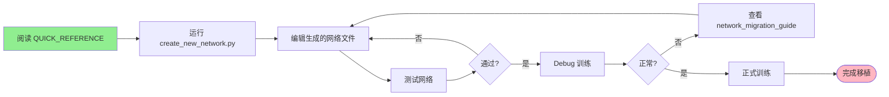

# BasicSR 网络移植模板使用指南

AI 多媒体开发工程师必备工具集

---

## 🎯 快速导航

### 我想...

| 需求 | 查看文档 | 用时 |
|------|---------|------|
| **快速了解怎么移植** | `QUICK_REFERENCE.md` | 5分钟 |
| **详细学习移植流程** | `network_migration_guide.md` | 30分钟 |
| **看完整示例** | `complete_example/示例：移植SRCNN网络.md` | 15分钟 |
| **复制代码模板** | `arch_template.py` 等 | 3分钟 |
| **自动生成文件** | `create_new_network.py` | 1分钟 |

---

## 🚀 三种使用方式

### 方式 1: 自动生成（推荐初学者）⭐⭐⭐⭐⭐

```bash
cd templates

# 一键生成所有文件
python create_new_network.py \
  --name MyNet \
  --scale 4 \
  --dataset DIV2K \
  --output_dir ..

# 会自动创建:
#   basicsr/archs/mynet_arch.py
#   options/train/MyNet/train_MyNet_x4.yml
#   options/test/MyNet/test_MyNet.yml
#   README_MyNet.md
```

**优势**: 零配置，一键生成所有文件

---

### 方式 2: 手动复制模板（推荐进阶用户）⭐⭐⭐⭐

```bash
# 1. 复制网络架构模板
cp templates/arch_template.py basicsr/archs/mynet_arch.py

# 2. 复制配置文件模板
cp templates/train_config_template.yml options/train/MyNet/train_MyNet_x4.yml
cp templates/test_config_template.yml options/test/MyNet/test_MyNet.yml

# 3. 编辑文件，实现你的网络
```

**优势**: 灵活，可以选择性复制需要的模块

---

### 方式 3: 参考示例学习（推荐高级用户）⭐⭐⭐⭐⭐

```bash
# 1. 阅读完整示例
cat templates/complete_example/示例：移植SRCNN网络.md

# 2. 参考现有网络实现
cat basicsr/archs/rrdbnet_arch.py
cat basicsr/archs/edsr_arch.py

# 3. 参考模板，从头编写
```

**优势**: 深入理解，完全掌控

---

## 📚 模板文件说明

### 核心模板（必读）

| 文件 | 说明 | 何时使用 |
|------|------|---------|
| `arch_template.py` | 网络架构模板（4个示例） | ✅ 每次都需要 |
| `train_config_template.yml` | 训练配置模板 | ✅ 每次都需要 |
| `test_config_template.yml` | 测试配置模板 | ✅ 每次都需要 |

### 可选模板（按需使用）

| 文件 | 说明 | 何时使用 |
|------|------|---------|
| `data_template.py` | 数据集模板（4个示例） | ⚠️ 需要自定义数据加载 |
| `model_template.py` | 模型模板（2个示例） | ⚠️ 需要自定义训练逻辑 |
| `loss_template.py` | 损失函数模板（6个示例） | ⚠️ 需要自定义损失 |
| `utils_template.py` | 工具函数模板（9个示例） | ⚠️ 需要辅助工具 |

### 参考文档

| 文件 | 说明 |
|------|------|
| `network_migration_guide.md` | 完整移植指南（500+行） |
| `QUICK_REFERENCE.md` | 快速参考（一页纸） |
| `示例：移植SRCNN网络.md` | 完整实战示例 |

---

## 🎓 学习路径

### 路径 1: 快速入门（1小时）

```
1. 阅读 QUICK_REFERENCE.md (10分钟)
2. 运行 create_new_network.py (5分钟)
3. 实现简单网络 (30分钟)
4. Debug 训练测试 (15分钟)
```

### 路径 2: 系统学习（半天）

```
1. 阅读 network_migration_guide.md (1小时)
2. 学习 arch_template.py 所有示例 (1小时)
3. 阅读 示例：移植SRCNN网络.md (30分钟)
4. 实战移植一个网络 (1.5小时)
```

### 路径 3: 深入掌握（1-2天）

```
1. 完整阅读所有模板文件 (2小时)
2. 研究 BasicSR 现有网络代码 (3小时)
3. 移植 2-3 个不同类型的网络 (1天)
4. 编写自定义数据集和损失 (3小时)
```

---

## 🔧 常用命令速查

### 创建新网络

```bash
# 自动创建
python templates/create_new_network.py --name MyNet --scale 4

# 手动创建
cp templates/arch_template.py basicsr/archs/mynet_arch.py
```

### 测试网络

```python
# 单元测试
cd basicsr/archs
python mynet_arch.py

# 集成测试
python -c "from basicsr.archs import build_network; \
  net=build_network({'type':'MyNet','num_in_ch':3,'upscale':4}); \
  print(net)"
```

### 训练命令

```bash
# Debug 模式
python basicsr/train.py -opt config.yml --debug

# 正式训练
python basicsr/train.py -opt config.yml

# 多 GPU
CUDA_VISIBLE_DEVICES=0,1,2,3 python -m torch.distributed.launch \
  --nproc_per_node=4 basicsr/train.py -opt config.yml --launcher pytorch

# 恢复训练
python basicsr/train.py -opt config.yml --auto_resume
```

### 测试命令

```bash
# 标准测试
python basicsr/test.py -opt test_config.yml

# 指定 GPU
CUDA_VISIBLE_DEVICES=0 python basicsr/test.py -opt test_config.yml
```

### TensorBoard 监控

```bash
tensorboard --logdir tb_logger/ --port 6006
# 访问 http://localhost:6006
```

---

## 💡 实战技巧

### 技巧 1: 渐进式开发

```
阶段 1: 最小可运行
  - 简单网络（几层卷积）
  - 小数据集（10-100 张图）
  - Debug 模式训练

阶段 2: 功能完善
  - 完整网络结构
  - 完整数据集
  - 短时间训练（1-2k iter）

阶段 3: 性能优化
  - 调优网络结构
  - 调优超参数
  - 完整训练
```

### 技巧 2: 复用优先

```
优先级:
  1. 能用现有的就不新建（80%情况）
  2. 必须新建时参考模板（15%情况）
  3. 从头编写（5%情况）

示例:
  - 数据集: 90% 用 PairedImageDataset
  - 损失: 80% 用 L1Loss/CharbonnierLoss
  - 模型: 70% 用 SRModel
  - 网络: 100% 需要自己写（这是核心）
```

### 技巧 3: 参数调优顺序

```
1. 网络结构参数（num_feat, num_block）
2. 训练参数（lr, batch_size）
3. 数据增强参数（gt_size, augmentation）
4. 损失权重（loss_weight）
5. 学习率调度（milestones, gamma）
```

---

## ⚠️ 常见陷阱

### 陷阱 1: 忘记注册

```python
# ❌ 错误
class MyNet(nn.Module):
    pass

# ✅ 正确
@ARCH_REGISTRY.register()
class MyNet(nn.Module):
    pass
```

### 陷阱 2: 配置文件 type 不匹配

```yaml
# ❌ 错误
network_g:
  type: mynet  # 小写

# ✅ 正确（必须与类名一致）
network_g:
  type: MyNet
```

### 陷阱 3: 数据集返回格式错误

```python
# ❌ 错误
def __getitem__(self, index):
    return img_lq, img_gt

# ✅ 正确
def __getitem__(self, index):
    return {
        'lq': img_lq,
        'gt': img_gt,
        'lq_path': path
    }
```

### 陷阱 4: 网络输出尺寸错误

```python
# 确保输出尺寸正确
def forward(self, x):
    # x: (B, 3, 64, 64)
    out = self.net(x)
    # out: (B, 3, 256, 256)  # 4倍超分
    assert out.shape[2:] == (x.shape[2]*self.upscale, x.shape[3]*self.upscale)
    return out
```

---

## 📞 获取帮助

### 问题排查优先级

```
1. 检查 QUICK_REFERENCE.md 的常见错误 ✅
2. 检查日志中的错误信息 ✅
3. 参考示例代码 ✅
4. 查看 BasicSR 官方文档 ✅
5. 搜索 GitHub Issues ✅
```

### 调试技巧

```python
# 打印网络结构
print(model)

# 打印参数量
from templates.utils_template import count_parameters
print(count_parameters(model))

# 测试前向传播
x = torch.randn(1, 3, 64, 64)
y = model(x)
print(f"输入: {x.shape} -> 输出: {y.shape}")

# 测试梯度
y.sum().backward()
print("✅ 梯度正常")
```

---

## 🎉 成功标志

移植成功的标志:

- ✅ 网络可以正常前向传播
- ✅ Debug 模式可以训练几个 iter
- ✅ 损失正常下降
- ✅ TensorBoard 有曲线
- ✅ 验证可以计算 PSNR/SSIM
- ✅ 测试可以输出图像

---

## 📦 模板清单总览

```
templates/
├── README.md                           # 本文件
├── 使用指南.md                          # 详细使用说明
├── network_migration_guide.md          # 完整移植指南（500+行）
├── QUICK_REFERENCE.md                  # 快速参考（一页纸）
│
├── arch_template.py                    # 网络架构模板（4个示例）
├── data_template.py                    # 数据集模板（4个示例）
├── model_template.py                   # 模型模板（2个示例）
├── loss_template.py                    # 损失函数模板（6个示例）
├── utils_template.py                   # 工具函数模板（9个示例）
│
├── train_config_template.yml           # 训练配置模板
├── test_config_template.yml            # 测试配置模板
│
├── create_new_network.py               # 自动创建工具
│
└── complete_example/
    └── 示例：移植SRCNN网络.md          # 完整实战示例
```

---

## 🌟 推荐工作流



---

**开始你的网络移植之旅吧！** 🚀

有问题随时参考这些文档，90% 的问题都能找到答案。

